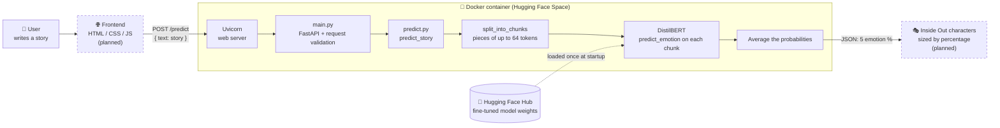

# Inside Out Emotion Classifier 
## 🧠 How it works

**Request flow:** the story is sent to the API, split into chunks that fit the model's 64-token window, classified chunk by chunk, and averaged into five percentages: joy, sadness, anger, fear and disgust. Stories are never stored.

